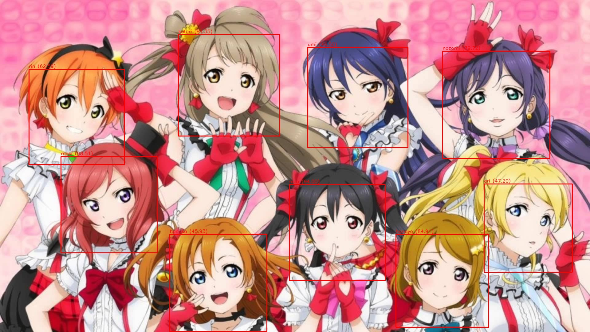

# muse-classifier

Classifies characters from the idol group *muse* from the franchise *Love Live!*.

Unlike methods from [here](https://github.com/freedomofkeima/transfer-learning-anime) and [here](http://christina.hatenablog.com/entry/2015/01/23/212541), this classifier extracts features from pretrained models and classifies characters based on those features using an SVM. This leads to significantly faster training time (~1m39s on Quadro K2000+Xeon E5-2640) at the cost of accuracy.

## Dataset

For each of the 9 characters in *muse*, I collected give-or-take 77 images with their respective tags from yande.re and konachan.com. Faces were extracted from the images using [lbp-cascade](https://github.com/nagadomi/lbpcascade_animeface) and hand-filtered so as to remove noise, other characters and non-conforming art styles (ie. chibi versions). They were then all scaled to 128x128px.

The dataset is comprised of 688 files, 5% of them is used for validation.

## Pipeline

For the model, deep, high-level features is extracted from each image of every character. Then, the features are normalized using a stddev scaler. Using PCA, the feature space of X dimensions is reduced to Y components. The post-reduced features are finally classified using a support vector machine (SVM).

ResNet50 (X=2048) and Y=320 is used for the model. The SVM used has parameters of `{'svc__C': 1, 'svc__kernel': 'linear'}`

With the current dataset it can classify 98.5% of the training set correctly and 91.4% of the validation set correctly.
